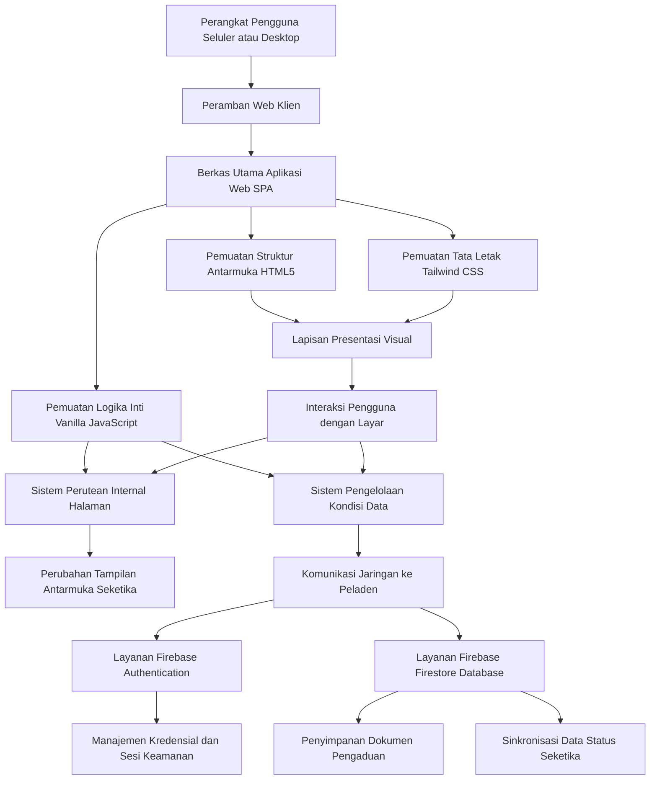
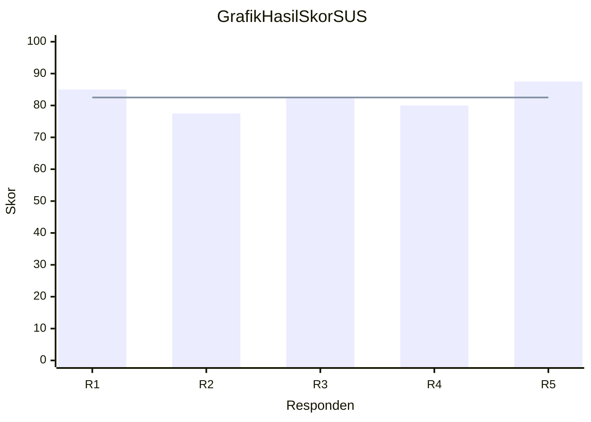

# LAPORAN AKHIR: CampusCareGI
**Sistem Pengaduan Fasilitas Kampus Terpadu**

---

## BAB 1 – PENDAHULUAN

### 1.1 Latar Belakang
Dalam ekosistem pendidikan tinggi modern, kualitas infrastruktur dan fasilitas kampus memegang peranan esensial dalam menunjang keberhasilan proses akademik. Kondisi lingkungan belajar yang ideal, seperti tersedianya proyektor yang berfungsi penuh, pendingin ruangan (AC) yang sejuk, hingga kelayakan kursi dan meja, memiliki korelasi langsung terhadap tingkat konsentrasi dan kenyamanan mahasiswa. Fasilitas fisik yang beroperasi secara optimal bukan sekadar pemanis, melainkan sebuah kebutuhan dasar yang memampukan terselenggaranya kegiatan belajar mengajar yang efektif. Namun, pada praktiknya, tingginya frekuensi dan intensitas penggunaan ruang kelas oleh berbagai program studi setiap harinya membuat risiko keausan atau kerusakan fasilitas menjadi suatu keniscayaan yang tidak dapat dihindari.

Permasalahan krusial seringkali tidak bersumber dari kerusakan fasilitas itu sendiri, melainkan pada kelemahan sistem dalam menangani siklus pelaporan dan perbaikan. Di sebagian besar instansi pendidikan, prosedur pengaduan kerusakan infrastruktur masih mengandalkan mekanisme yang sangat konvensional dan terdesentralisasi. Ketika mahasiswa menemukan fasilitas yang tidak berfungsi, mereka umumnya hanya melapor secara lisan kepada staf tata usaha, mengeluh kepada petugas kebersihan yang kebetulan lewat, atau sekadar membagikan foto kerusakan tersebut di grup aplikasi pesan instan kelas tanpa tindak lanjut yang jelas. Praktik ini terbukti menciptakan inefisiensi yang signifikan dalam tata kelola fasilitas kampus.

Ketidakmampuan sistem konvensional ini melahirkan efek domino yang merugikan berbagai pihak. Dari sisi mahasiswa, ketiadaan saluran pelaporan resmi yang transparan memunculkan rasa apatis. Mereka merasa aspirasinya tidak dihargai karena tidak ada rekam jejak maupun umpan balik terkait sejauh mana laporan mereka telah ditindaklanjuti. Akibatnya, banyak kerusakan kecil yang dibiarkan hingga akhirnya menjadi kerusakan mayor. Sementara itu, dari sudut pandang manajemen aset kampus, ketiadaan sistem pencatatan terpusat menyebabkan teknisi dan pengelola fasilitas kehilangan orientasi dalam menentukan skala prioritas perbaikan, yang pada akhirnya memicu lambatnya waktu respons penanganan.

Menyadari urgensi dari celah struktural tersebut, transformasi digital dalam tata kelola fasilitas kampus menjadi sebuah keharusan. Oleh karena itu, diusulkanlah pengembangan CampusCareGI, sebuah platform pelaporan fasilitas kampus terpadu yang dibangun di atas arsitektur web modern yaitu Single Page Application (SPA). Pilihan teknologi SPA ditujukan untuk memberikan pengalaman pengguna yang cepat, ringan, dan responsif sekelas aplikasi bawaan, tanpa memaksa mahasiswa mengunduh aplikasi tambahan yang memberatkan ruang penyimpanan gawai mereka. Dengan hadirnya sistem ini, diharapkan mahasiswa dapat berpartisipasi aktif dalam menjaga lingkungan kampus dengan melaporkan kerusakan secara seketika beserta bukti visual, sementara pihak pengelola dapat mengelola siklus perbaikan secara terukur, sistematis, dan transparan.

### 1.2 Identifikasi Masalah
Berdasarkan uraian latar belakang di atas, terdapat beberapa masalah fundamental yang berhasil diidentifikasi dalam tata kelola fasilitas kampus saat ini, yaitu:

1. Ketidakadaan Platform Terpusat
Belum tersedianya sebuah platform digital yang responsif dan terstandarisasi bagi sivitas akademika, khususnya mahasiswa, untuk melaporkan kerusakan fasilitas kampus secara seketika. Hal ini menyebabkan pelaporan menjadi tidak terarah dan bergantung pada kebetulan bertemunya mahasiswa dengan petugas kebersihan atau staf tata usaha.

2. Kurangnya Transparansi dan Visibilitas Penanganan
Proses pelaporan yang masih menggunakan jalur manual atau sekadar komunikasi lisan mengakibatkan hilangnya rekam jejak penanganan. Pelapor sering merasa frustrasi karena tidak ada umpan balik yang jelas mengenai apakah laporan mereka sudah diterima, sedang dikerjakan, atau ditunda. Ketiadaan transparansi ini menurunkan minat mahasiswa untuk peduli terhadap fasilitas di sekitarnya.

3. Inefisiensi Manajemen Data Kerusakan
Pihak pengelola fasilitas, baik administrator maupun teknisi, mengalami kesulitan besar dalam mengumpulkan, mengklasifikasi, dan memprioritaskan jadwal perbaikan. Data laporan yang masuk tersebar secara tidak terstruktur di berbagai medium komunikasi, sehingga penentuan skala prioritas seringkali keliru dan berdampak pada lambatnya waktu respons perbaikan.

4. Panjangnya Rantai Birokrasi
Terdapat jeda waktu yang sangat panjang antara saat mahasiswa menemukan fasilitas yang tidak berfungsi hingga teknisi kampus turun ke lapangan untuk melakukan tindakan. Birokrasi yang memakan waktu ini tidak sejalan dengan tuntutan era digital yang mengedepankan kecepatan dan efisiensi penyelesaian masalah.

### 1.3 Tujuan
Pengembangan proyek CampusCareGI ini disusun dengan beberapa tujuan strategis untuk menjawab permasalahan yang telah diidentifikasi sebelumnya, yaitu:

1. Melakukan Riset Pengguna secara Mendalam
Tujuan pertama adalah melaksanakan riset pengguna untuk mengidentifikasi kendala, kebiasaan, serta ekspektasi mahasiswa dalam melaporkan masalah fasilitas. Hasil riset ini digunakan sebagai landasan perancangan antarmuka pengguna dan pengalaman pengguna yang sesuai dengan prinsip desain yang berpusat pada manusia.

2. Membangun Purwarupa Sistem Interaktif
Tujuan kedua adalah merancang dan mengimplementasikan aplikasi berbasis web dengan arsitektur Single Page Application (SPA). Pemilihan arsitektur ini bertujuan untuk memberikan pengalaman bernavigasi yang sangat cepat dan mulus tanpa jeda muat ulang halaman, sehingga mensimulasikan kenyamanan menggunakan aplikasi bawaan pada telepon pintar.

3. Menerapkan Sistem Basis Data Terpusat
Tujuan ketiga adalah mengintegrasikan platform pelaporan dengan teknologi basis data awan menggunakan layanan Firebase. Integrasi ini bertujuan untuk mengotomatisasi penyimpanan data laporan secara permanen, sekaligus memfasilitasi operasional pengelolaan data serta sistem autentikasi yang aman dan efisien bagi administrator maupun mahasiswa.

---

## BAB 2 – USER RESEARCH

### 2.1 Metode
Tahapan riset pengguna merupakan fondasi kritis dalam memastikan bahwa solusi yang dibangun sangat relevan dengan permasalahan di lapangan. Oleh karena itu, penelitian ini menggunakan metode riset kualitatif melalui teknik wawancara mendalam yang bersifat semi terstruktur. Pendekatan semi terstruktur dipilih karena memberikan kerangka panduan pertanyaan pokok yang jelas, namun tetap memberikan keleluasaan bagi responden untuk mengeksplorasi cerita atau keluhan mereka secara natural.

Pengambilan sampel dalam riset ini menggunakan teknik pemilihan sampel bersyarat, yaitu pemilihan responden berdasarkan kriteria spesifik yang telah ditentukan agar selaras dengan target pengguna utama aplikasi. Wawancara ini dilakukan secara tatap muka kepada lima orang mahasiswa aktif yang berasal dari berbagai program studi. Adapun kriteria utama pemilihan responden tersebut adalah mahasiswa yang aktif menggunakan fasilitas ruang kelas minimal tiga kali dalam seminggu dan memiliki pengalaman langsung menghadapi fasilitas kampus yang tidak berfungsi.

### 2.2 Hasil Wawancara

A. Daftar Pertanyaan Wawancara
1. Bisakah Anda ceritakan sedikit tentang rutinitas Anda sehari hari di kampus dan seberapa sering Anda menggunakan fasilitas kelas?
2. Pernahkah Anda menemukan fasilitas kampus yang rusak (misal: AC panas, proyektor mati, kursi patah)?
3. Ketika Anda menemukan kerusakan tersebut, apa tindakan spesifik yang Anda lakukan saat itu?
4. Apa alasan utama yang mendasari Anda untuk memilih tindakan tersebut (melapor atau membiarkan)?
5. Sejauh yang Anda ketahui, bagaimana prosedur resmi pelaporan kerusakan fasilitas yang berlaku di kampus saat ini?
6. Berdasarkan pengalaman Anda, apa kendala terbesar saat Anda ingin melaporkan suatu fasilitas yang rusak?
7. Jika kampus menyediakan aplikasi pelaporan kerusakan, fitur wajib apa saja yang menurut Anda harus ada?
8. Bagaimana ekspektasi Anda terkait kejelasan informasi atau progres dari laporan yang telah Anda buat?
9. Apakah Anda lebih memilih menggunakan aplikasi berbasis web tanpa instalasi atau mengunduh aplikasi khusus di Play Store? Mengapa?
10. Seberapa penting bagi Anda untuk memiliki platform pelaporan fasilitas kampus yang seketika?

B. Profil Responden
Wawancara mendalam ini dilakukan kepada tiga orang mahasiswa aktif yang sesuai dengan kriteria target pengguna. Berikut adalah profil ketiganya:
1. Chaerul Aziel Ardiansyah (NIM 1124160129), Mahasiswa Teknik Informatika Semester 4. Sering berada di kampus dari pagi hingga sore dan kritis terhadap fasilitas perkuliahan yang tidak memadai.
2. Ahmad Ilyas (NIM 1125170130), Mahasiswa Teknik Informatika Semester 4. Sangat aktif berorganisasi dan hampir setiap hari menggunakan fasilitas laboratorium komputer maupun ruang kelas.
3. Maharani Kusuma Dewi (NIM 1124160115), Mahasiswi Teknik Informatika Semester 4. Sangat memprioritaskan kenyamanan ruang kelas dan aktif meminjam perlengkapan presentasi.

C. Ringkasan Hasil Wawancara
Berdasarkan wawancara yang telah dilakukan, berikut adalah rincian jawaban langsung dari ketiga responden:

Pertama, Chaerul Aziel Ardiansyah menyatakan bahwa ia cukup sering menemukan masalah pada fasilitas kelas, terutama pada proyektor dan pendingin ruangan. Ketika menemukannya, Chaerul mengaku cenderung membiarkannya dan hanya pindah tempat duduk. Alasan utamanya adalah ia merasa pelaporan manual kepada staf tata usaha terlalu membuang waktu dan jarang ditanggapi dengan cepat. Menurut Chaerul, fitur yang paling wajib ada jika kampus membuat platform pelaporan adalah fitur unggah foto agar teknisi langsung mengetahui detail kerusakan. Ia juga sangat menolak keharusan mengunduh aplikasi baru karena ruang penyimpanan gawainya sudah penuh.

Kedua, Ahmad Ilyas memiliki pengalaman serupa di mana ia mendapati kerusakan pada fasilitas laboratorium komputer. Berbeda dengan Chaerul, Ilyas sempat berinisiatif melapor secara lisan kepada petugas kebersihan. Namun, karena tidak ada sistem pelacakan status, ia merasa frustrasi karena tidak tahu apakah laporannya diteruskan ke teknisi atau diabaikan. Ilyas sangat mengharapkan adanya platform pelaporan seketika yang bisa diakses langsung melalui peramban web tanpa perlu instalasi. Baginya, visibilitas progres perbaikan sangatlah penting agar mahasiswa merasa aspirasinya benar benar didengar oleh pihak kampus.

Ketiga, Maharani Kusuma Dewi menyoroti kendala birokrasi kampus yang dirasa terlalu kaku. Saat menemukan fasilitas kelas yang rusak, Maharani hanya membagikan keluhan tersebut di grup angkatan dengan harapan ada ketua kelas yang sudi mewakilinya melapor. Maharani menilai prosedur saat ini sama sekali tidak transparan. Ia sangat mendambakan antarmuka pelaporan yang sesederhana mungkin. Ia membayangkan sebuah sistem di mana mahasiswa cukup menekan tautan web, memfoto fasilitas yang rusak, menulis lokasi spesifik, lalu memantaunya. Kecepatan respons teknisi kampus adalah prioritas mutlak baginya.

### 2.3 Analisis
Berdasarkan pendalaman terhadap hasil wawancara di atas, ditarik empat klasifikasi analisis utama mengenai karakteristik dan ekspektasi target pengguna, yaitu:

1. Titik Masalah (Pain Point)
Masalah terbesar yang dirasakan oleh mahasiswa terletak pada panjangnya birokrasi pelaporan manual yang dinilai sangat membuang waktu produktif mereka. Selain itu, ketiadaan sistem transparansi atau pelacakan membuat mahasiswa merasa aspirasi mereka sebagai sivitas akademika diabaikan. Ketidakpastian mengenai kapan keluhan mereka ditindaklanjuti merupakan sumber frustrasi utama yang memicu sikap apatis terhadap pemeliharaan fasilitas.

2. Tujuan (Goals)
Tujuan utama pengguna sangatlah sederhana dan pragmatis. Mereka menginginkan sebuah sistem di mana kerusakan fasilitas dapat dilaporkan hanya dalam hitungan detik tanpa hambatan birokrasi fisik. Dari sisi penyelesaian, mereka berharap fasilitas yang dilaporkan dapat segera diperbaiki oleh teknisi agar lingkungan belajar mengajar dapat kembali nyaman, kondusif, dan aktivitas perkuliahan tidak terganggu.

3. Kebutuhan Pengguna
Untuk mencapai tujuan tersebut, mahasiswa sangat membutuhkan platform pelaporan berbasis web yang ringan dan dapat diakses seketika melalui tautan, tanpa keharusan mengunduh aplikasi tambahan. Mereka juga mewajibkan ketersediaan fitur unggah foto langsung dari kamera sebagai bukti kerusakan yang valid. Kebutuhan krusial lainnya adalah hadirnya dasbor pelacakan status laporan secara langsung agar mereka dapat memantau apakah laporan mereka sedang dalam antrean, sedang dikerjakan, atau sudah selesai.

4. Kebiasaan Pengguna
Karakteristik mahasiswa saat ini sangat lekat dengan penggunaan telepon pintar dan media sosial. Mereka terbiasa dengan antarmuka digital yang interaktif dan memiliki tingkat kesabaran yang sangat rendah terhadap pengisian formulir teks yang panjang dan rumit. Oleh karena itu, pengguna lebih menyukai interaksi visual seperti menekan tombol besar atau mengunggah gambar dibandingkan harus mengetik deskripsi panjang mengenai kerusakan fasilitas.

---

## BAB 3 – PERANCANGAN UI/UX

### 3.1 User Persona
Berdasarkan sintesis data dari wawancara mendalam dengan ketiga responden Chaerul, Ahmad, dan Maharani, kami merumuskan satu karakter fiktif User Persona bernama Rafli Kurniawan yang mewakili mayoritas pengguna target aplikasi CampusCareGI. Persona ini difokuskan pada mahasiswa yang aktif, memiliki mobilitas tinggi, dan sangat menghargai efisiensi.

#### Profil Pengguna Rafli Kurniawan

Demografi
20 Tahun, Mahasiswa S1 Teknik Informatika Semester 4.

Karakteristik
Sangat aktif di kampus, paham teknologi, kritis terhadap lingkungan belajar, dan menyukai kepraktisan.

Perangkat Utama
Ponsel pintar dengan ruang penyimpanan yang sudah cukup penuh.

#### Tujuan

1. Mampu melaporkan kerusakan fasilitas kampus seperti masalah proyektor atau AC dalam hitungan detik tanpa hambatan birokrasi.
2. Mendapatkan pembaruan status perbaikan secara waktu nyata untuk memastikan keluhannya diteruskan ke teknisi dan dikerjakan.
3. Menciptakan suasana belajar yang kondusif tanpa gangguan kerusakan teknis.

#### Motivasi

1. Memiliki kepedulian yang tinggi terhadap aset kampus karena intensitas penggunaannya setiap hari.
2. Menginginkan adanya transparansi sebagai bukti bahwa pihak kampus benar benar mendengarkan aspirasi mahasiswa.

#### Titik Frustrasi

1. Sering merasa frustrasi karena pelaporan lisan kepada petugas seringkali diabaikan atau tidak ada sistem pelacakan status.
2. Keberatan jika harus mengunduh aplikasi seluler tambahan karena lebih menyukai akses langsung yang tidak membebani memori gawainya.

#### Kebutuhan

1. Platform pelaporan seketika berbasis peramban web tanpa perlu instalasi.
2. Dasbor atau antarmuka yang menunjukkan visibilitas progres perbaikan secara jelas.
3. Fitur unggah foto langsung dari kamera sebagai bukti kerusakan yang valid.

### 3.2 Empathy Map
Untuk memahami aspek psikologis dan emosional dari Persona Rafli Kurniawan saat berinteraksi dengan masalah fasilitas kampus, berikut adalah pemetaan empatinya Empathy Map :

#### SAYS Apa yang dikatakan

1. Ini proyektornya kok mati lagi sih? Padahal minggu lalu udah lapor tapi nggak ada perubahan.
2. Males banget kalau disuruh ngisi formulir kertas ke TU cuma buat lapor AC netes.
3. Udah deh, foto aja sebar ke grup kelas biar ada yang ngewakilin bilang ke staf.

#### THINKS Apa yang dipikirkan

1. Berpikir bahwa manajemen kampus lamban dan memiliki rantai birokrasi yang usang.
2. Merasa skeptis dan berasumsi laporannya tidak akan dibaca apabila tidak ada bukti progres atau transparansi.
3. Mengharapkan sistem pelaporan di kampus bisa semudah aplikasi modern pada umumnya.

#### DOES Apa yang dilakukan

1. Memfoto fasilitas yang bermasalah namun seringkali pada akhirnya hanya menjadi keluhan di grup WhatsApp tanpa solusi.
2. Mencoba mengatasi masalah secara mandiri misal menghindari area AC bocor, meminjam proyektor dari kelas lain.
3. Cenderung bersikap apatis karena merasa melapor secara manual adalah tindakan yang sia sia.

#### FEELS Apa yang dirasakan

1. Frustrasi Terganggu kenyamanan belajarnya akibat kendala fasilitas ruangan.
2. Diabaikan Merasa aspirasinya kurang dihargai akibat tidak adanya umpan balik pelaporan.
3. Lelah Enggan membuang energi untuk melaporkan kerusakan secara konvensional.

### 3.3 Wireframe
Perancangan antarmuka tahap awal dilakukan dengan membuat Wireframe menggunakan Figma. Wireframe disesuaikan dengan kebutuhan aplikasi akhir, yaitu desain aplikasi Single Page Application (SPA).

High Fidelity Wireframe
Desain dirancang secara mendetail menggunakan layout final, warna, tipografi, dan icon (Lucide Icons) yang merepresentasikan produk akhir. Tema yang digunakan adalah Navy dan Purple untuk memberikan kesan modern, rapi, dan tepercaya.

Link Figma
Masukkan Tautan Figma Anda Di Sini

Screenshot Halaman
Catatan Masukkan screenshot seluruh halaman desain High Fidelity Wireframe dari Figma Anda di sini

### 3.4 Prototype
Tahap lanjutan setelah penyusunan kerangka layar adalah pembuatan prototipe interaktif menggunakan fitur Prototyping yang disediakan oleh Figma. Pembuatan prototipe ini bertujuan untuk mensimulasikan navigasi aliran kerja dan transisi antarmuka sehingga memberikan gambaran nyata mengenai interaksi pengguna dengan sistem. Langkah ini sangat krusial untuk mengevaluasi pengalaman pengguna dan mendeteksi potensi kebingungan alur sebelum aplikasi benar benar dikembangkan oleh pemrogram. Mengingat sistem pengaduan ini mengusung arsitektur Single Page Application (SPA), simulasi interaksi dibuat sedemikian rupa agar meniru pergantian komponen halaman yang cepat dan mulus tanpa proses muat ulang peramban secara utuh.

Simulasi Alur
Prototipe mendukung simulasi klik (interaksi) mulai dari halaman Login, masuk ke Dashboard, menavigasi ke halaman Form Pengaduan, hingga mengecek daftar Riwayat Laporan untuk sisi mahasiswa. Sedangkan untuk sisi administrator, simulasi mencakup alur login admin, masuk ke dasbor manajemen laporan, dan mengubah status perbaikan fasilitas.

Link Prototype Figma
Masukkan Tautan Prototype Figma Anda Di Sini

Screenshot Prototype dan Interaction Flow
Catatan Masukkan gambar alur panah interaksi (Interaction Flow) dari workspace Figma Anda di sini untuk membuktikan bahwa prototype berfungsi

---

## BAB 4 – IMPLEMENTASI

### 4.1 Teknologi
Aplikasi CampusCareGI diimplementasikan sebagai web Single Page Application atau SPA. Pendekatan ini dipilih untuk memberikan pengalaman pengguna yang cepat dan dinamis layaknya aplikasi asli, tanpa proses memuat ulang halaman secara keseluruhan. Berikut adalah teknologi utama yang digunakan dalam pengembangan purwarupa aplikasi ini.

Teknologi pertama adalah HTML5 yang berfungsi sebagai kerangka struktural utama halaman web. Dalam konteks arsitektur SPA, peran HTML5 difokuskan pada penyediaan elemen kontainer dinamis di mana konten di dalamnya akan diganti dan dimanipulasi secara langsung oleh fungsi JavaScript sesuai dengan status navigasi pengguna.

Teknologi kedua adalah Tailwind CSS yang digunakan untuk merealisasikan desain antarmuka dari wireframe menjadi bentuk nyata. Tailwind CSS merupakan sebuah kerangka kerja utility first CSS yang mempercepat proses perancangan visual karena pengembang dapat memberikan kelas gaya secara langsung pada elemen HTML. Tailwind memastikan seluruh antarmuka aplikasi bersifat responsif terhadap berbagai ukuran layar dan sangat memudahkan penerapan efek estetika modern seperti gradasi warna hingga efek kaca.

Selanjutnya adalah Vanilla JavaScript yang digunakan untuk membangun logika operasional dan interaktivitas aplikasi tanpa kerangka kerja tambahan seperti React atau Vue. JavaScript bertugas secara krusial untuk melakukan manipulasi Document Object Model untuk mengatur perpindahan antarmuka secara seketika. JavaScript juga menangani interaksi pengguna seperti pengisian formulir pengaduan dan melakukan pemanggilan antarmuka pemrograman aplikasi ke sistem basis data.

Untuk elemen ikonografi antarmuka didukung oleh integrasi Lucide Icons. Pustaka ikon open source berbasis vektor ini dipilih karena menghadirkan desain yang sangat bersih, konsisten, modern, serta sangat ringan sehingga tidak membebani waktu muat halaman aplikasi.

Tahap terakhir adalah hosting yang memanfaatkan platform komputasi awan modern seperti Vercel atau Netlify. Proses ini memastikan aplikasi CampusCareGI siap digunakan secara daring dan dapat diakses dari mana pun oleh mahasiswa melalui tautan aplikasi yang disediakan.

### 4.2 Arsitektur Sistem

Berikut adalah diagram alur kerja arsitektur sistem pada aplikasi CampusCareGI.

Sistem ini menggunakan arsitektur Single Page Application yang memungkinkan seluruh komponen antarmuka aplikasi mulai dari halaman masuk, dasbor mahasiswa, dasbor admin, formulir pengaduan, hingga riwayat dimuat sekaligus di dalam satu berkas utama.

Dalam arsitektur tradisional, berpindah dari halaman masuk ke dasbor akan memaksa peramban web untuk memuat ulang layar sepenuhnya dan mengunduh berkas HTML baru dari peladen. Namun pada arsitektur yang diterapkan di aplikasi CampusCareGI, perpindahan halaman sepenuhnya ditangani secara internal oleh JavaScript dengan memanipulasi kelas CSS. 

Sebagai contoh setiap halaman dibungkus dalam sebuah elemen kontainer. Ketika pengguna menekan tombol navigasi, JavaScript akan menjalankan fungsi untuk menyembunyikan kontainer sebelumnya dan menampilkan kontainer yang dituju. Metode ini menghasilkan transisi antar antarmuka yang instan, mulus, dan bebas kedipan, sehingga memberikan pengalaman pengguna yang menyamai tingkat kelancaran sebuah aplikasi terinstal.

### 4.3 Firebase
Untuk mengelola logika peladen dan fungsionalitas data secara dinamis tanpa perlu membangun peladen mandiri, aplikasi ini terintegrasi sepenuhnya dengan layanan Backend as a Service dari ekosistem Firebase. 

Integrasi pertama adalah layanan Firebase Authentication yang diimplementasikan untuk menangani keamanan dan manajemen identitas pengguna. Sistem ini mendukung dua metode masuk utama. Metode pertama adalah otentikasi pihak ketiga melalui akun Google yang dikhususkan bagi mahasiswa agar proses masuk menjadi lebih praktis dan instan. Metode kedua menggunakan kombinasi surel dan kata sandi yang dienkripsi khusus untuk menjaga keamanan akses bagi pengelola atau administrator. Dengan adanya layanan ini, sistem dapat secara otomatis membedakan hak akses dan mencegah pengguna biasa untuk masuk ke dasbor manajemen laporan.

Integrasi kedua adalah layanan Firebase Firestore Database yang bertindak sebagai basis data NoSQL berbasis awan. Keunggulan utama dari Firestore adalah kemampuannya menyinkronkan data secara seketika pada layar seluruh pengguna yang sedang aktif tanpa harus memuat ulang halaman. Pada aplikasi CampusCareGI, struktur basis data ini dibagi menjadi tiga kumpulan dokumen utama yang saling terhubung untuk mendukung jalannya aplikasi.

Kumpulan dokumen pertama bernama kumpulan pengguna yang bertugas menyimpan profil dasar seperti nama lengkap, alamat surel, dan peran hak akses dari setiap entitas yang berhasil melakukan pendaftaran otentikasi. Data ini penting untuk memastikan rekam jejak pengguna selalu tercatat dalam sistem.

Kumpulan dokumen kedua bernama kumpulan fasilitas yang berfungsi sebagai data induk atau referensi sistem. Koleksi ini menyimpan daftar fasilitas ruang kelas atau area kampus apa saja yang tersedia untuk dilaporkan, beserta status keaktifannya. Administrator dapat menambah atau menghapus daftar fasilitas ini kapan saja melalui dasbor mereka, dan perubahannya akan langsung terlihat di formulir pelaporan mahasiswa.

Kumpulan dokumen ketiga sekaligus yang paling utama adalah kumpulan pengaduan. Koleksi ini bertugas menyimpan seluruh rekaman laporan kerusakan yang dikirimkan oleh mahasiswa. Setiap dokumen pengaduan memuat informasi detail yang mencakup nama pelapor, lokasi spesifik kejadian, deskripsi masalah, tautan gambar bukti yang telah dikompresi, cap waktu pelaporan, hingga status penanganan saat ini. Administrator berhak memanipulasi dokumen ini untuk mengubah statusnya dari menunggu menjadi diproses atau selesai, serta menambahkan catatan khusus sebagai bentuk umpan balik langsung kepada pelapor.

### 4.4 Screenshot Aplikasi
Berikut adalah dokumentasi tangkapan layar dari aplikasi web yang telah berhasil dipublikasikan. Catatan untuk penulis, silakan masukkan tangkapan layar aplikasi yang sedang berjalan di peramban pada bagian ini, minimal mencakup halaman masuk, beranda, tambah laporan, dan riwayat.

## BAB 5 EVALUASI KENGGUNAAN SISTEM

### 5.1 Data Responden
Pengujian kegunaan sistem ini melibatkan lima orang responden yang berasal dari kalangan mahasiswa aktif. Kelima responden tersebut dipilih secara acak untuk merepresentasikan pengguna akhir aplikasi. Setiap responden diberikan tugas untuk menjalankan skenario penggunaan utama yang meliputi proses masuk ke dalam sistem, menambah laporan pengaduan baru, serta melihat daftar riwayat laporan yang telah dibuat. Setelah menyelesaikan seluruh skenario tersebut, responden diminta untuk mengisi kuesioner System Usability Scale yang memuat sepuluh butir pernyataan standar guna mengukur tingkat kepuasan dan kemudahan penggunaan aplikasi.

### 5.2 Hasil Perhitungan SUS
Setelah seluruh data kuesioner terkumpul, dilakukan perhitungan skor untuk setiap responden menggunakan rumus standar SUS. Pada instrumen ini, setiap pernyataan bernilai 1 hingga 5, lalu disesuaikan nilainya untuk pernyataan ganjil (positif) dan genap (negatif), kemudian dijumlahkan dan dikalikan dengan bobot 2.5. 

Berdasarkan perhitungan tersebut, perolehan skor akhir adalah sebagai berikut:
1. Skor Responden Pertama: 85.0
2. Skor Responden Kedua: 77.5
3. Skor Responden Ketiga: 82.5
4. Skor Responden Keempat: 80.0
5. Skor Responden Kelima: 87.5

Dari kelima nilai individu tersebut, didapatkan Nilai Rata Rata SUS Keseluruhan sebesar 82.5.

### 5.3 Grafik Hasil
Berikut adalah gambaran visualisasi grafik untuk membandingkan skor masing masing responden terhadap nilai rata rata kelayakan. Garis mendatar menunjukkan nilai rata rata dari keseluruhan responden.

### 5.4 Kesimpulan dan Interpretasi
Nilai rata rata sebesar 82.5 kemudian dicocokkan dengan standar acuan interpretasi kategori SUS berikut:
1. Skor di atas 80.3 masuk kategori **Excellent**
2. Skor antara 68 hingga 80.3 masuk kategori **Good**
3. Skor tepat di angka 68 masuk kategori **Average**
4. Skor antara 51 hingga 67 masuk kategori **Poor**
5. Skor di bawah 51 masuk kategori **Awful**

Karena perolehan rata rata aplikasi CampusCareGI berada di angka 82.5 (melampaui 80.3), maka interpretasi hasil akhir pengujian secara mutlak masuk ke dalam kategori Excellent. Kesimpulan akhirnya adalah antarmuka aplikasi terbukti sangat ramah pengguna, mudah dipelajari, dan memenuhi standar kepuasan pengguna secara maksimal.

## BAB 6 KESIMPULAN DAN SARAN

### 6.1 Kesimpulan
Melalui penerapan metode perancangan yang berpusat pada pengguna, aplikasi web antarmuka tunggal CampusCareGI berhasil dirancang dan dibangun secara utuh. Temuan awal pada riset pengguna berhasil memvalidasi kebutuhan mahasiswa akan sebuah wadah pelaporan yang cepat dan tidak membebani kapasitas memori telepon pintar. Integrasi dengan teknologi awan dari Firebase juga mampu memenuhi ekspektasi performa sinkronisasi data yang responsif. Dengan berbekal nilai evaluasi kegunaan akhir sebesar 82.5, dapat ditarik kesimpulan bahwa produk akhir dari proyek purwarupa ini telah memenuhi kriteria kelayakan yang sangat memuaskan.

### 6.2 Saran
Dalam rencana pengembangan lebih lanjut untuk masa yang akan datang, aplikasi ini disarankan untuk ditingkatkan kemampuannya agar dapat menangani pengunggahan banyak foto sekaligus guna mendokumentasikan kondisi kerusakan dengan lebih menyeluruh. Selain itu penambahan fitur notifikasi peringatan instan berbasis aplikasi pesan singkat pihak ketiga juga sangat dianjurkan agar mahasiswa dapat mengetahui perubahan status laporan mereka secara otomatis tanpa harus memuat ulang situs web.
